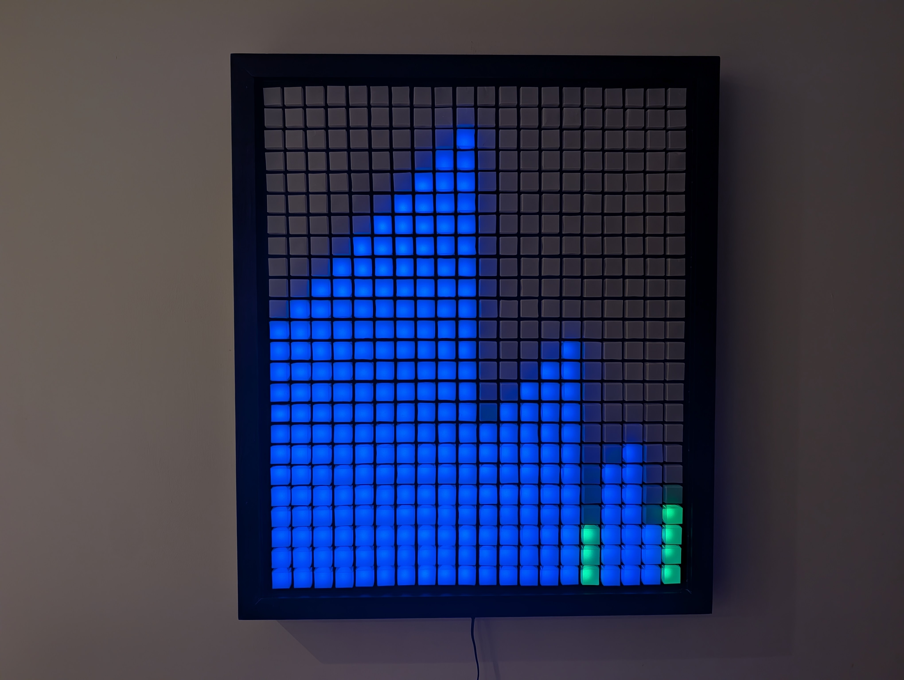
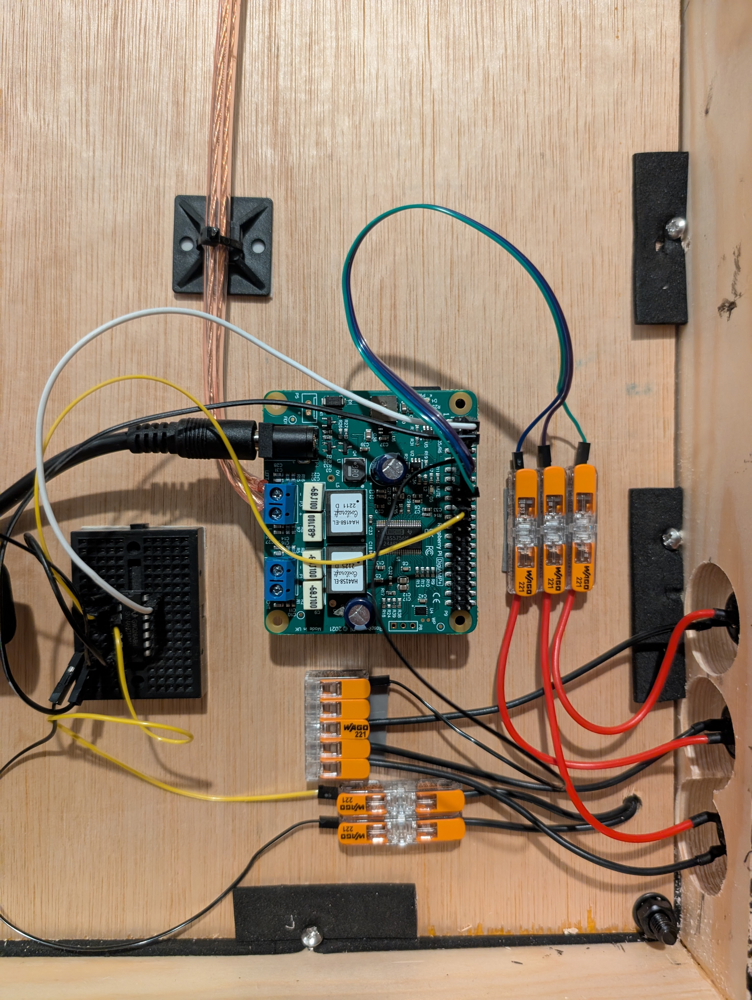
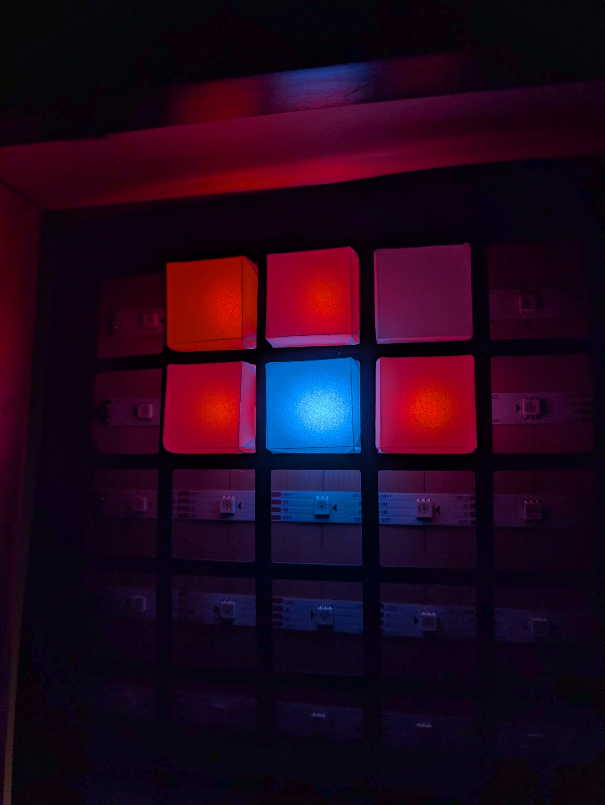

# LED Matrix Project

---

This project contains the complete code for a custom **LED Matrix** display and its accompanying **Next.js** web interface. It combines Python-based hardware control (using the Adafruit NeoPixel library), MQTT for fast local communication, and a beautiful Next.js dashboard for remote control.

A standout feature of this matrix is its ability to visualise sorting algorithms with synchronised audio feedback. This auditory experience, alongside the algorithmic logic, was heavily inspired by the brilliant work of [Timo Bingmann in his "Sound of Sorting"](https://panthema.net/2013/sound-of-sorting/) project. If you're exploring how these algorithms work, I highly recommend checking out his original project and the [comprehensive sorting algorithm cheat sheet](https://panthema.net/2013/sound-of-sorting/SoS-CheatSheet.pdf) featured on his blog, which served as a foundational reference for this build.

For a full project write-up, [click here](https://russelleveleigh.medium.com/what-does-an-algorithm-sound-like-bebe16eb33dd?sk=7675b182c43a4ff1dadfaa3f5baaf1a0). Or, to see it in action, watch the [YouTube video](https://www.youtube.com/watch?v=xQN_TD9Fapw).

---

## Features

* **Interactive Dashboard:** Control the matrix in real-time using a modern Next.js interface.
* **Audio Feedback:** Synthesised sounds and music playback synchronised with the matrix visuals.
* **Custom Algorithms:** Visualise sorting algorithms (Bubble, Quick, Merge, etc.), play games, or display text/images.
* **Maths Mode:** Interactive maths problems and visualisations on the matrix.
* **Navidrome Integration:** Search and play music from your personal Navidrome server directly on the matrix.

---

## Repository Structure

* **`LED Matrix Code/`**: Contains the Python scripts, HTML files, sound assets, and JSON files that run on the Raspberry Pi. This handles driving the WS2812B LEDs and playing audio.
* **`web interface/`**: Contains the Next.js React components (`LEDMatrixDashboard.tsx`) and API routes. You can drop these into your own Next.js project.
* **`MQTT/`**: Contains the Node-RED and Mosquitto setup guide to bridge the web dashboard and the Raspberry Pi.

---

## Dependencies & Requirements

### Hardware / Raspberry Pi Side
* **Adafruit CircuitPython NeoPixel:** Essential for driving the LEDs.
* **Paho MQTT:** For receiving commands from the broker.
* **Pygame:** Used for playing audio files and sound synthesis.
* **Mosquitto & Node-RED:** The middleware layer for secure local communication.

### Web Interface Side
* **Next.js:** The framework used for the web dashboard and API routes.
* **Shadcn/UI:** The dashboard relies on `shadcn/ui` components (like Card, Button, Tabs, Toast). You will need to install these in your project.
* **Lucide React:** Used for all the icons in the dashboard.
* **MongoDB (Optional):** Used for keeping score in the maths game.
* **gifuct-js:** Required for parsing and rendering GIF files on the matrix.

---

## Setup Instructions

1. **Hardware Setup:** Ensure your Raspberry Pi is wired correctly to your LED matrix. Note that you may need to run the Python script as `sudo` for NeoPixel access.
2. **Configure Node-RED and MQTT:** Follow the instructions in `MQTT/Setup_Guide.md` to establish the communication bridge.
3. **Configure the Python Script:** Open `LED Matrix Code/config.json` and replace all `<PLACEHOLDER>` tags with your local IPs, usernames, and passwords.
4. **Deploy the Web Interface:** Copy the contents of the `web interface` folder into your Next.js project's `app` directory. Add your `MATRIX_API_URL` to your `.env.local` file.

---

## Gallery

*Dayton Audio exciter transducer attached to the wooden frame, providing audio feedback.*

*LED matrix displaying a merge sort algorithm visualisation, highlighting the active column.*

*LED matrix displaying a sorting algorithm step.*

*LED matrix displaying the final part of a sorting algorithm, revealing that the data is now in order across the cyan/green and red sections.*

*The wooden back panel showing the Raspberry Pi, custom hat, Wago connectors, and wiring.*

*The LED matrix displaying a merge sort as a blue chart-like pattern.*

*Close-up of the custom Raspberry Pi hat and wiring.*

*Close-up of the diffusers covering the LEDs.*

*The LED matrix displaying the Raspberry Pi logo.*

### Image Licence

All photos in the `Photos` directory are licensed under the [Creative Commons Zero (CC0) 1.0 Universal License](https://creativecommons.org/publicdomain/zero/1.0/). This means they are dedicated to the public domain. You are completely free to copy, modify, distribute, and perform the work, even for commercial purposes, all without asking permission. While not required, a link back to this repository, the YouTube video, or the Medium article is always appreciated!
